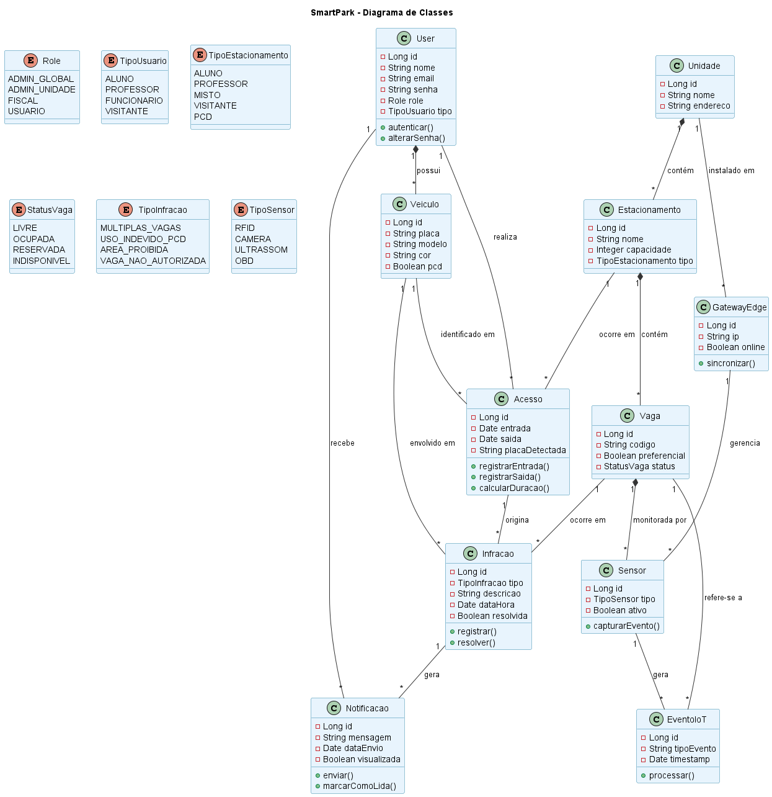
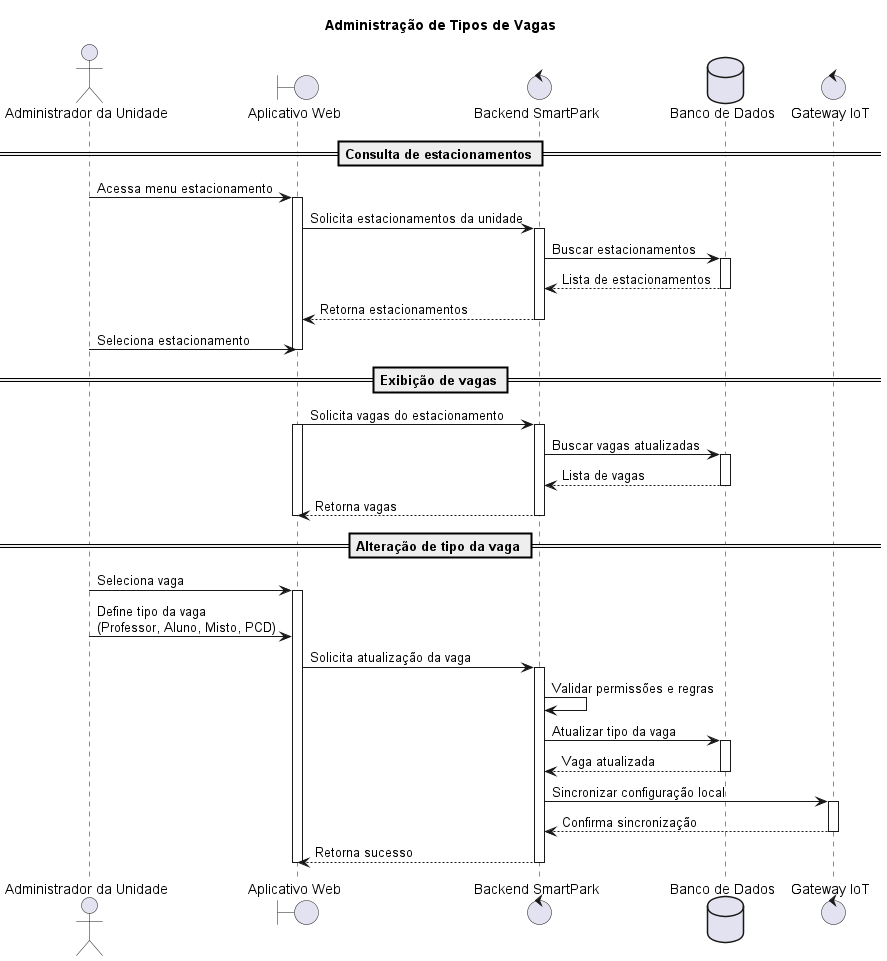
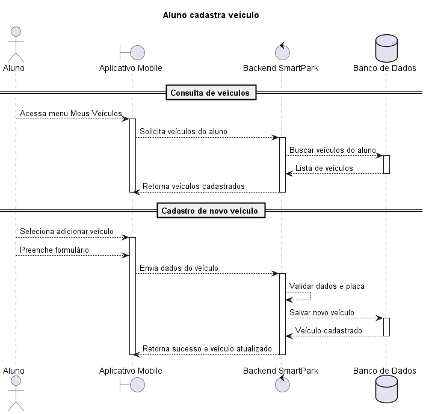
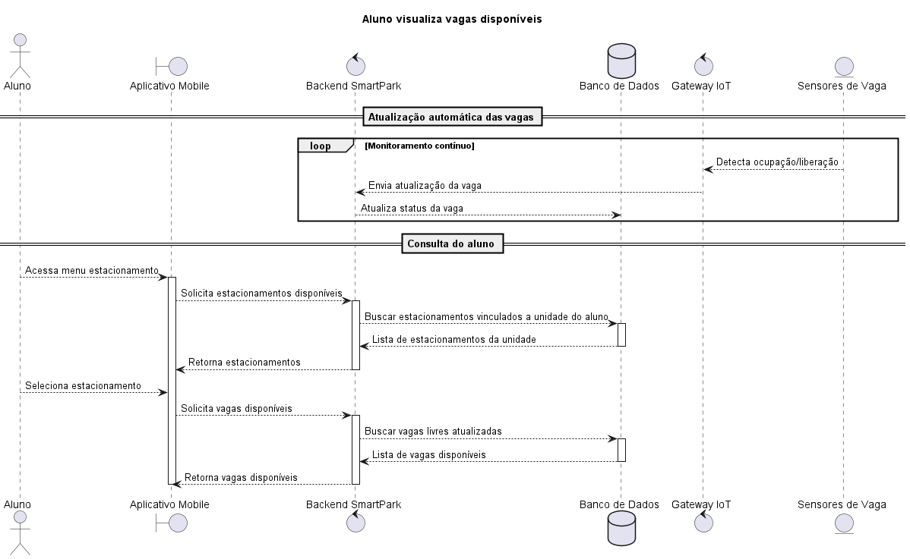

# 🏷️ SmartPark - Gestão Inteligente de Estacionamento Universitário 👨‍💻

## 🚧 Este projeto é somente para fins didáticos de arquitetura de software e elaboração de requisitos

## 📚 Índice
- [Sobre o Projeto](#-sobre-o-projeto)
- [Funcionalidades Principais](#-funcionalidades-principais)
- [Tecnologias Utilizadas](#-tecnologias-utilizadas)
- [Arquitetura](#-arquitetura)
  - [Exemplos de diagramas](#exemplos-de-diagramas)
- [Instalação e Execução](#-instalação-e-execução)
  - [Pré-requisitos](#pré-requisitos)
  - [Variáveis de Ambiente](#-variáveis-de-ambiente)
     - [1 Back-end (Spring Boot)](#1-back-end-spring-boot)
     - [2 Front-end (React, Vite)](#2-front-end-react-vite)
     - [3 Exemplos de Variáveis de Ambiente na Vercel](#3-exemplos-de-variáveis-de-ambiente-na-vercel)
  - [Instalação de Dependências](#-instalação-de-dependências)
    - [Front-end (React)](#front-end-react)
    - [Back-end (Spring Boot)](#back-end-spring-boot)
  - [Inicialização do Banco de Dados (PostgreSQL)](#-inicialização-do-banco-de-dados-postgresql)
  - [Como Executar a Aplicação](#-como-executar-a-aplicação)
    - [Terminal 1: Back-end (Spring Boot)](#terminal-1-back-end-spring-boot)
    - [Terminal 2: Front-end (React, Vite)](#terminal-2-front-end-react-vite)
    - [Execução Local Completa com Docker Compose (Incluindo Banco de Dados)](#-execução-local-completa-com-docker-compose-incluindo-banco-de-dados)
    - [Passos para build, inicialização e execução](#-passos-para-build-inicialização-e-execução)
- [Deploy](#-deploy)
- [Estrutura de Pastas](#-estrutura-de-pastas)
- [Demonstração](#-demonstração)
  - [Aplicativo Mobile](#-aplicativo-mobile)
  - [Aplicação Web](#-aplicação-web)
  - [Exemplo de saída no Terminal (para Back-end, API, CLI)](#-exemplo-de-saída-no-terminal-para-back-end-api-cli)
- [Testes](#-testes)
- [Documentações utilizadas](#-documentações-utilizadas)
- [Autores](#-autores)
- [Contribuição](#-contribuição)
- [Agradecimentos](#-agradecimentos)
- [Licença](#-licença)

## 📝 Sobre o Projeto

O SmartPark é uma plataforma inteligente de gerenciamento e monitoramento de estacionamentos universitários, desenvolvida com o objetivo de modernizar o controle de acesso veicular, otimizar a utilização de vagas e integrar tecnologias emergentes ao ecossistema acadêmico.

O projeto surgiu da necessidade de solucionar problemas recorrentes enfrentados em ambientes universitários, como dificuldade de localização de vagas disponíveis, uso indevido de vagas reservadas, ocupação incorreta de espaços, congestionamentos internos, ausência de monitoramento centralizado e baixa visibilidade operacional dos estacionamentos distribuídos entre múltiplas unidades acadêmicas.

Atualmente, muitas instituições de ensino ainda utilizam processos descentralizados e pouco automatizados para gerenciamento de estacionamentos, dependendo de controles manuais, fiscalização limitada e sistemas isolados sem integração em tempo real. Além disso, a ausência de monitoramento inteligente dificulta a identificação rápida de irregularidades e reduz a eficiência operacional dos estacionamentos institucionais.

Com o avanço da Internet das Coisas (IoT), da computação em nuvem e da Inteligência Artificial, tornou-se possível criar soluções capazes de monitorar vagas, controlar acessos e processar eventos em tempo real. Nesse contexto, o SmartPark foi concebido para unir gerenciamento institucional tradicional com tecnologias modernas de automação, telemetria e análise inteligente de dados.

A plataforma permite o gerenciamento centralizado de unidades acadêmicas, estacionamentos, vagas, usuários institucionais, permissões de acesso e monitoramento operacional em tempo real. O sistema também integra sensores IoT, cancelas inteligentes, dispositivos de edge computing e câmeras de monitoramento para detectar ocupação de vagas, registrar entradas e saídas de veículos e identificar infrações automaticamente.

Como diferencial, o sistema oferece integração com o aplicativo oficial da instituição, permitindo que alunos, professores e funcionários visualizem em tempo real a disponibilidade de vagas, recebam notificações operacionais e consultem informações relacionadas ao estacionamento de sua unidade.

Os dados coletados pelos sensores e dispositivos conectados são processados por módulos de Inteligência Artificial especializados em detecção de anomalias, análise preditiva e identificação automática de infrações, auxiliando gestores e equipes de segurança no monitoramento e fiscalização dos estacionamentos.

O projeto possui caráter acadêmico e experimental, sendo desenvolvido com foco em arquitetura e prototipagem de software distribuído, computação em nuvem, edge computing, microsserviços, IoT e observabilidade. Sua proposta busca representar uma possível evolução dos estacionamentos universitários tradicionais para um modelo inteligente, conectado e orientado por dados.

O SmartPark pode ser aplicado em universidades, centros universitários, campus corporativos, condomínios empresariais e ambientes de pesquisa tecnológica relacionados a smart campus, mobilidade inteligente e cidades conectadas.

---

## ✨ Funcionalidades Principais
Liste as funcionalidades de forma clara e objetiva.

- **Gerenciamento personalizável:** Crie e gerencie todos os estacionamentos de sua instituição
- **Orientado a integração:** Integre o sistema de aplicativo diretamente ao sistema de sua instituição
- **Análise em tempo real:** Sensores dinâmicos com atualização em tempo real
- **Validação automática:** Sistema pronto para validação de placa de veículo vínculado ao aluno e uso correto de vagas
- **Governança avançada:** Compare métricas, veja status de melhorias, pontos fracos e mais usados, veja como os seus alunos se distribuem.
---

## 🛠 Tecnologias Utilizadas

### 💻 Front-end

* **Framework/Biblioteca:** React v19.2
* **Linguagem/Superset:** TypeScript
* **Estilização:** Shadcn/UI + TailwindCSS
* **Gerenciamento de Estado:** Zustand
* **Build Tool:** Vite v8.0.14

### 🖥️ Back-end

* **Linguagem/Runtime:** Go 1.26
* **Framework:** Gin
* **Arquitetura:** Microsserviços + REST API
* **Banco de Dados:** PostgreSQL
* **Cache:** Redis
* **ORM / Query Builder:** GORM
* **Eventos:** Amazon MSK
* **Autenticação:** Amazon Cognito
* **Documentação da API:** Swagger / OpenAPI

### 🌐 IoT & Edge Computing

* **Linguagem:** Rust
* **Protocolos IoT:** MQTT
* **Gateway IoT:** AWS IoT Greengrass
* **IoT Platform:** AWS IoT Core
* **Mensageria:** Amazon MSK
* **Sensores:** Sensores inteligentes de ocupação
* **Comunicação:** MQTT + HTTP

### 📱 Mobile

* **Linguagem:** Dart
* **Framework:** Flutter
* **Ferramentas:** IntelliJ IDEA

### ⚙️ Infraestrutura & DevOps

* **Containerização:** Docker Compose
* **Infraestrutura como Código:** Terraform
* **Cloud:** AWS
* **CI/CD:** SonarQube, GitHub Actions
* **Security:** CrowdStrike, Trivy, Grype, Owasp Zap
* **Versionamento:** Git

---

## 🏗 Arquitetura

O SmartPark adota uma arquitetura de microsserviços hospedada na AWS, onde cada funcionalidade como autenticação, gestão de estacionamentos, controle de acesso, notificações e análise inteligente são implementados como um serviço independente em Go/Gin, executado em containers Docker orquestrados pelo Amazon ECS. A comunicação entre os clientes (aplicativo Flutter e painel web em React) e os microsserviços é intermediada pelo Amazon API Gateway, com autenticação centralizada via Amazon Cognito. Na camada de dados, o Amazon RDS com PostgreSQL armazena os dados relacionais da plataforma, enquanto o Amazon ElastiCache com Redis provê cache de estado em tempo real. A integração com o ecossistema IoT ocorre através do AWS IoT Greengrass, executado nos gateways de edge instalados nos estacionamentos das universidades, que coletam eventos de sensores, cancelas e câmeras via MQTT e os encaminham ao AWS IoT Core, que os publica no Amazon MSK (Kafka) para consumo assíncrono pelos microsserviços. O módulo de AI/Analytics processa esse stream de eventos para detecção de anomalias, identificação de infrações e análise preditiva de ocupação. A observabilidade da plataforma é centralizada no Amazon CloudWatch, e toda a infraestrutura é provisionada como código via Terraform, com pipelines de CI/CD gerenciados pelo GitHub Actions.

#### Diagrama de Sistema

#### Diagrama de Classe

#### Diagrama de Componentes

#### Diagrama de Implantação

#### Diagramas de Sequência

---

## 👥 Autores
Liste os principais contribuidores. Você pode usar links para seus perfis.

|  Nome |  Foto | GitHub |  LinkedIn |  
|---------|----------|-----------------|-------------|
| João Marcos  | 

 | 

 | 

 | 

---
